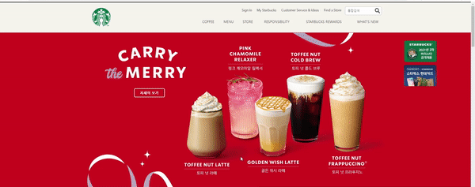
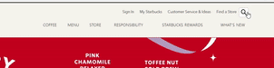
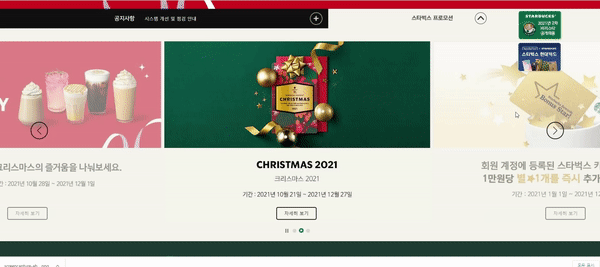

<h1 align="center">
  ☕ Starbucks_clone_coding
</h1>

<div align="center">
    
    
    

</div>

<br />

### 👀 [starbucks_clone](https://abcabcp.github.io/starbucks_clone/)
<br />

## 🔍 구현화면
### ✔ fullpage


### ✔ menu


### ✔ search


### ✔ swipe


<br />

---
<br />

## 📁 폴더 구조

```
STARBUCKS_CLONE
├─ css
|  └─ reset.css
|  └─ style.css
├─ font
├─ js
|  └─ main.js
|  └─ swiper.js
|  └─ aos.js
|
└─ index.html
```

<br />

## 👯‍♀️ TEAM
  이슬기, [노희재](https://github.com/heejj1206)

<br />

## 💕 나의 업무
  * 메뉴바, 서브메뉴, 이미지 광고, 우측 레이어 배너 등 html, css, js 구현
  * 통합검색 버튼 구현
  * 공지사항 텍스트 롤링 구현
  * 이미지 -> aos 라이브러리 사용

<br />

## 😄 아쉬운 점 
  시간 관계상 반응형 처리를 하지 못한 부분과 라이브러리를 사용한 애니메이션 구현이 조금 아쉽다. 여유가 될 때 팀원과 같이 보완을 해 볼 예정이다.
  
